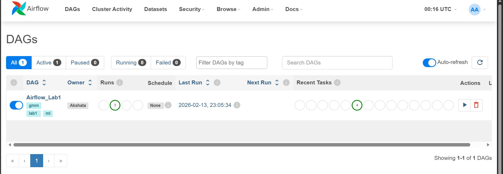
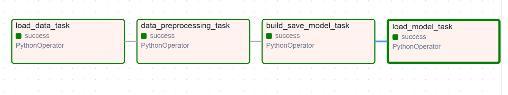
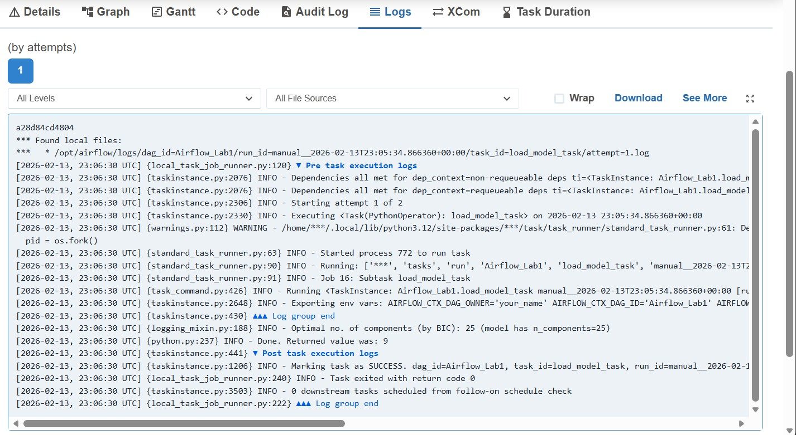

# Airflow Lab 1
This lab runs a **machine learning pipeline** on Apache Airflow: load data → preprocess → fit a **Gaussian Mixture Model (GMM)** → select the best number of components with **BIC (Bayesian Information Criterion)** → save the model and predict on test data. All steps are implemented as Airflow tasks with dependencies and XCom for passing data between tasks.

---


## Overview

The pipeline consists of **four tasks** in sequence:

| Task | Description |
|------|-------------|
| **load_data_task** | Reads the training CSV from the data directory, serializes it, and pushes a base64-encoded payload to XCom. |
| **data_preprocessing_task** | Deserializes the data, drops nulls, selects feature columns, applies MinMax scaling, and pushes the scaled array (serialized) to XCom. |
| **build_save_model_task** | Fits a GMM for `n_components = 1..25`, selects the best model by **BIC**, saves it to `model/model.sav`, and pushes the list of BIC values to XCom. |
| **load_model_task** | Loads the saved GMM, reports the optimal number of components (lowest BIC), predicts on `test.csv`, and returns the first predicted cluster id. |

Data is passed between tasks via **XCom** (base64-encoded serialized payloads and JSON-serializable lists), so no pickling configuration is required for this lab.

---

## Topics Covered

- Defining an Airflow **DAG** with **PythonOperator** tasks.
- Setting **task dependencies** and passing **outputs** between tasks using XCom.
- Running a multi-step ML workflow (load → preprocess → train → evaluate) inside Airflow.
- Using **tags**, **documentation**, **retries**, and **execution timeouts** on the DAG and tasks.
- Configuring data paths and feature columns via **environment variables** so the same code works in different environments.

---

## Prerequisites

- **Docker** and **Docker Compose** (Docker Desktop or Docker Engine).
- At least **4 GB RAM** for Docker (8 GB recommended). Check with:
  ```bash
  docker run --rm "debian:bullseye-slim" bash -c 'numfmt --to iec $(echo $(($(getconf _PHYS_PAGES) * $(getconf PAGE_SIZE))))'
  ```
- **Python 3.8+** on the host only for running the sample data generator locally; the DAG runs inside the Airflow containers with dependencies installed there.

---

## Directory Structure

```
Labs/Airflow_Labs/
├── docker-compose.yaml    # Airflow stack (scheduler, webserver, workers, postgres, redis)
├── .env                   # AIRFLOW_UID and optional overrides
├── README.md         # This file
├── dags/
│   ├── airflow.py        # Lab 1 DAG definition
│   ├── src/
│   │   ├── __init__.py
│   │   └── lab.py        # load_data, data_preprocessing, build_save_model, load_model_elbow
│   ├── data/             # Training and test CSVs (mounted into container)
│   │   ├── file.csv      # Training data (required columns: BALANCE, PURCHASES, CREDIT_LIMIT)
│   │   ├── test.csv      # Test data (same feature columns)
│   │   └── README.md     # Data format and sample generator usage
│   ├── model/            # Created at runtime; saved model written here
│   └── scripts/
│       └── generate_sample_data.py   # Generates file.csv and test.csv when no dataset is available
├── logs/                 # Airflow logs (created on first run)
├── config/               # Optional airflow.cfg override
└── plugins/              # Optional Airflow plugins
```

Inside the container, `dags` is mounted at `/opt/airflow/dags`, so paths in code resolve under that directory.

---

## Quick Start

From the **repository root** (e.g. `MLOps/`):

```bash
cd Labs/Airflow_Labs

# 1. Create .env with host user ID
echo "AIRFLOW_UID=50000" > .env

# 2. Ensure data exists (or generate sample data)
python dags/scripts/generate_sample_data.py

# 3. Initialize the database (first time only)
docker compose up airflow-init

# 4. Start Airflow
docker compose up -d

# 5. Open http://localhost:8080 — login (default: airflow / airflow), then trigger the "Airflow_Lab1" DAG.
```

Wait until the webserver is healthy (e.g. logs show `GET /health 200`), then trigger the DAG from the UI.

---

## Detailed Setup

### 1. Clone and enter the lab directory

```bash
cd Labs/Airflow_Labs
```

### 2. Running Airflow in Docker

1. Ensure **Docker Desktop** is running.
2. Fetch `docker-compose.yaml` if not already present:
   ```bash
   # Windows
   curl -o docker-compose.yaml https://airflow.apache.org/docs/apache-airflow/2.9.2/docker-compose.yaml
   ```
   (Or use the `docker-compose.yaml` already in this lab.)
3. Create required directories:
   ```bash
  
   # Windows (cmd)
   mkdir dags logs plugins config

   ```
4. Set the Airflow user (creates `.env`):
   ```bash
  
   # On Windows, create `.env` with:

   AIRFLOW_UID=50000
   ```
5. Update `docker-compose.yaml`:
   ```yaml
   # Do not load examples
   AIRFLOW__CORE__LOAD_EXAMPLES: 'false'

   # Additional Python packages
   _PIP_ADDITIONAL_REQUIREMENTS: ${_PIP_ADDITIONAL_REQUIREMENTS:- pandas scikit-learn kneed}

   # Output dir
   - ${AIRFLOW_PROJ_DIR:-.}/working_data:/opt/airflow/working_data

   # Default admin credentials (optional)
   _AIRFLOW_WWW_USER_USERNAME: ${_AIRFLOW_WWW_USER_USERNAME:-airflow2}
   _AIRFLOW_WWW_USER_PASSWORD: ${_AIRFLOW_WWW_USER_PASSWORD:-airflow2}
   ```
6. Initialize the database (first time only; takes a few minutes):
   ```bash
   docker compose up airflow-init
   ```
7. Start Airflow:
   ```bash
   docker compose up
   ```
8. Wait until the terminal shows:
    ```
    airflow-webserver-1  | 127.0.0.1 - - [DD/Mon/YYYY:HH:MM:SS +0000] "GET /health HTTP/1.1" 200 ...
    ```

9. Visit **http://localhost:8080** and log in with the credentials from step 7.
10. The DAG **Airflow_Lab1** appears in the UI (tags: lab1, ml, gmm; schedule: None). Trigger it manually or enable the toggle.



*DAGs page showing Airflow_Lab1 active with tags and run history.* Progress can be monitored in the Grid or Graph view; logs are in the UI and in the `logs/` directory.
11. After the DAG completes: click the DAG → **Graph** tab → click `load_model_task` → **Logs** tab to see the result (optimal number of components by BIC).
12. Stop Airflow:
    ```bash
    docker compose down
    ```

## Data

### Required format

- **file.csv** (training): Must include the feature columns used for clustering. Default: `BALANCE`, `PURCHASES`, `CREDIT_LIMIT`. Extra columns are allowed and ignored.
- **test.csv**: Same feature columns; one or more rows. The pipeline predicts on the first row and returns its cluster id.


### Configuring paths and columns

All of the following are optional; defaults work when CSVs are in `dags/data/` with the default column names.

| Variable | Default | Description |
|----------|---------|-------------|
| `LAB1_DATA_DIR` | `dags/data` (resolved inside container) | Directory containing train and test CSVs. |
| `LAB1_TRAIN_FILE` | `file.csv` | Training filename. |
| `LAB1_TEST_FILE` | `test.csv` | Test filename. |
| `LAB1_MODEL_DIR` | `dags/model` | Directory where `model.sav` is written. |
| `LAB1_FEATURE_COLUMNS` | `BALANCE,PURCHASES,CREDIT_LIMIT` | Comma-separated feature column names. |

Set these in the `environment` section of the Airflow services in `docker-compose.yaml`, or in a custom `.env` / entrypoint so they are visible to the scheduler and workers.

### Generate sample data

From `Labs/Airflow_Labs`:

```bash
python dags/scripts/generate_sample_data.py
```

Options:

- `--out-dir dags/data` — Output directory (default: `dags/data`).
- `--train-rows 500` — Number of rows in `file.csv`.
- `--seed 42` — Random seed.

Requires `pandas` and `numpy` on the host (or run inside a venv that has them).

---

## DAG Overview

- **DAG id:** `Airflow_Lab1` (configurable via `DAG_ID` in `dags/airflow.py`).
- **Schedule:** `None` (manual trigger only by default). For scheduled runs, set `SCHEDULE = "@daily"` or another cron expression in `airflow.py`.
- **Tags:** `lab1`, `ml`, `gmm` (for filtering in the UI).
- **Default args:** 1 retry after 2 minutes, 15-minute execution timeout per task.

Task flow:

```
load_data_task → data_preprocessing_task → build_save_model_task → load_model_task
```


*Graph view of the four tasks (PythonOperator) and their dependencies; green indicates success.*

- **load_data_task** pushes the serialized training data (base64) to XCom.
- **data_preprocessing_task** takes that via `load_data_task.output`, preprocesses, and pushes the scaled array (base64) to XCom.
- **build_save_model_task** takes the preprocessed data and writes `model/model.sav`, pushes the BIC list to XCom.
- **load_model_task** takes the saved model path and the BIC list (from `build_save_model_task.output`), loads the model, reports optimal k, runs prediction on `test.csv`, and returns the first cluster id.

Each task has a short **doc_md** description visible in the Airflow UI when opening the task.

---

## Running the Lab

1. Open **http://localhost:8080** and log in.
2. Find the DAG **Airflow_Lab1** (or filter by tag **lab1** or **gmm**).
3. Unpause the DAG (toggle on the left).
4. Click **Trigger DAG** (play button).
5. Open the run (e.g. from **Grid** or **Graph** view) and click a task to see **Logs** and **Task Instance Details**. For the pipeline result (optimal number of components and returned value), open **load_model_task** → **Logs** tab.



*Logs tab for load_model_task: optimal number of components (by BIC) and returned value.*

### What to expect

- **load_data_task:** Logs “We are here” (if left in code) and completes quickly.
- **data_preprocessing_task:** Reads XCom from the previous task, runs MinMax scaling, pushes result to XCom.
- **build_save_model_task:** Fits GMMs for k=1..25, selects best by BIC, saves to `dags/model/model.sav`, pushes BIC list to XCom. This is the slowest task.
- **load_model_task:** Loads `model.sav`, prints optimal number of components (by BIC), predicts on `test.csv`, and returns an integer (cluster id).

The final task’s return value is stored in XCom and visible in the task’s **XCom** tab in the UI.

### Outputs

- **Model file:** `dags/model/model.sav` (GMM pickle).
- **XCom:** Serialized data and BIC list between tasks; last task’s XCom is the predicted cluster id.

---

## Configuration Reference

### DAG-level (in `dags/airflow.py`)

| Variable | Default | Description |
|----------|---------|-------------|
| `DAG_ID` | `"Airflow_Lab1"` | DAG identifier in the UI. |
| `SCHEDULE` | `None` | Schedule (e.g. `None`, `"@daily"`, `"0 0 * * *"`). |
| `default_args["owner"]` | `"Akshata"` | Owner of the DAG. |
| `default_args["retries"]` | `1` | Number of retries on failure. |
| `default_args["retry_delay"]` | `2 minutes` | Delay before retry. |
| `default_args["execution_timeout"]` | `15 minutes` | Max runtime per task. |

### Environment variables (for `src/lab.py`)

See [Data – Configuring paths and columns](#configuring-paths-and-columns).

### Docker / Airflow image

- **Image:** `apache/airflow:2.9.2` (set via `AIRFLOW_IMAGE_NAME` in `.env`).
- **PIP packages** (in `docker-compose.yaml`): `pandas`, `scikit-learn`, `kneed`. GMM uses only `scikit-learn`; `kneed` is optional for this lab.

---

## Troubleshooting

### DAG shows “Broken DAG” or import errors

- **Import error for `airflow.operators.python`:** Use `from airflow.operators.python import PythonOperator` (core import). Avoid `airflow.providers.standard.operators.python` unless the standard provider is installed.
- **No module named `src`:** Ensure `dags/src/` exists and contains `__init__.py` and `lab.py`. The DAG is loaded with `dags` on the Python path.
- **Missing pandas/sklearn:** Confirm `_PIP_ADDITIONAL_REQUIREMENTS` in docker-compose includes `pandas scikit-learn` and restart the scheduler/workers after the first startup so pip installs run.

### Training or test file not found

- Ensure `file.csv` and `test.csv` exist in `dags/data/` (or the path set by `LAB1_DATA_DIR` / `LAB1_TRAIN_FILE` / `LAB1_TEST_FILE`).
- Run the sample data generator: `python dags/scripts/generate_sample_data.py` from `Labs/Airflow_Labs`.

### Feature columns not found

- The CSV must contain the columns listed in `LAB1_FEATURE_COLUMNS` (default: `BALANCE`, `PURCHASES`, `CREDIT_LIMIT`). Set `LAB1_FEATURE_COLUMNS` to match the CSV column names (comma-separated, no spaces unless in the name).

### Task timeout or very slow

- **build_save_model_task** fits 25 GMMs; on large data it can approach the 15-minute timeout. Increase `execution_timeout` in `default_args` or reduce the number of components (edit `max_components` in `build_save_model` in `lab.py`).

### XCom or serialization errors

- This lab uses base64-encoded payloads and JSON-serializable lists only; no XCom pickling is required. If the code is changed to push non-JSON-serializable objects, pickling may need to be enabled (e.g. Airflow 3.x: `AIRFLOW__CORE__ENABLE_XCOM_PICKLING=True`).

### Restart services after code or env changes

```bash
docker compose restart airflow-scheduler airflow-webserver
# If using workers:
docker compose restart airflow-worker
```

---

## References

- [Apache Airflow Documentation](https://airflow.apache.org/docs/)
- [Running Airflow in Docker](https://airflow.apache.org/docs/apache-airflow/stable/howto/docker-compose.html)
- [PythonOperator](https://airflow.apache.org/docs/apache-airflow/stable/operators/python.html)
- [sklearn GaussianMixture](https://scikit-learn.org/stable/modules/mixture.html)
- [BIC for model selection](https://en.wikipedia.org/wiki/Bayesian_information_criterion)
