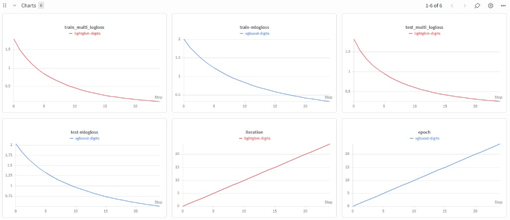
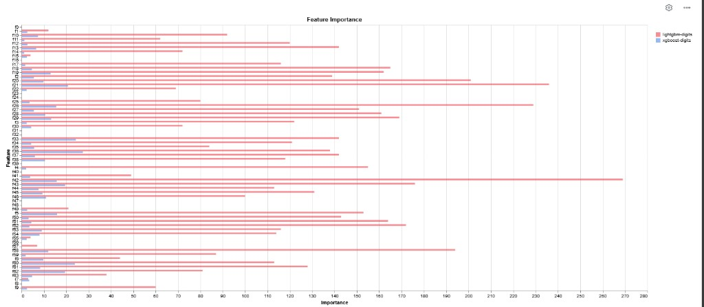
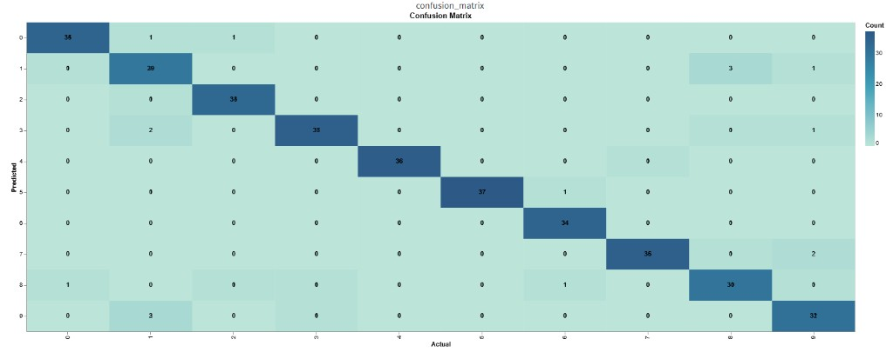

# Experiment tracking with Weights & Biases (W&B)

Comparing **XGBoost** and **LightGBM** on sklearn Digits and logging metrics to W&B.

---

## What `wandb_boosting_comparison.py` does 

1. **Load data** — Calls `sklearn.datasets.load_digits()`: ~1,797 samples, 64 features (8×8 digit images flattened), 10 classes (digits 0–9).

2. **Split** — Stratified **train/test** split (default 80% / 20%, `--test-size`), same `random_state` so both models see **identical** train and test rows.

3. **Train XGBoost** (optional; default runs both):
   - Builds `DMatrix` for train/test.
   - Trains with `multi:softmax`, fixed hyperparameters in `config`, and **`--num-round`** boosting rounds (default 25).
   - If not `--dry-run`: uses **`wandb.xgboost.WandbCallback()`** so each round logs **train/test multiclass log loss** to W&B.
   - Logs **`test_accuracy`** on the run summary and **`wandb.sklearn.plot_confusion_matrix`** for the test set.

4. **Finish XGBoost run** — `wandb.finish()` ends the first run so the next model gets a **separate** run.

5. **Train LightGBM** — Same data split, same number of rounds:
   - `lgb.Dataset` with feature names `f0`…`f63`.
   - Uses **`wandb.integration.lightgbm.wandb_callback` (not `WandbCallback`)** in wandb 0.22+ for per-round metrics.
   - After training, **`log_summary`** adds feature importance (and best iteration/summary when available).
   - Logs confusion matrix and **`test_accuracy`** like XGBoost.

6. **Print** — Project URL and reminder to compare runs in the UI.

**Why two W&B runs?** Each library has its own integration. Metric **names** differ (e.g. `train-mlogloss` vs `train_multi_logloss`), so W&B often shows **separate** chart panels—select both runs and both metrics when comparing.

---

## Steps to run

### 1. Environment (once)

```powershell
cd Labs\Experiment_Tracking_Labs\W&B
python -m venv .venv
.\.venv\Scripts\Activate.ps1
pip install wandb xgboost lightgbm scikit-learn numpy
```

### 2. Log in to W&B (once per machine)

```powershell
python -m wandb login
```


### 3. Run the script

**Smoke test (no cloud):**

```powershell
python wandb_boosting_comparison.py --dry-run
```

**Full experiment (uploads metrics and media):**

```powershell
python wandb_boosting_comparison.py
```

### 4. Open the W&B UI

Copy the **project URL** printed in the terminal (e.g. `https://wandb.ai/akshata-kumble-northeastern-university/digits-xgb-vs-lgb`). Open it in a browser and select runs **`xgboost-digits`** and **`lightgbm-digits`**.
---

## Example results

### Training and test loss curves



**Interpretation**

- Both models **reduce multiclass log loss** over boosting rounds; curves are smooth, so the learning rate and tree depth are reasonable for this task.
- **LightGBM** (red) reaches **lower** train and test loss than **XGBoost** (blue) by the end of training in this run—on this split, LightGBM fits the data better under the chosen hyperparameters.
- Train and test losses for each model **track together**—no strong sign of overfitting in this short run.
- **Naming:** XGBoost logs `train-mlogloss` / `test-mlogloss`; LightGBM logs `train_multi_logloss` / `test_multi_logloss`. They are the same kind of metric but appear on **different** panels unless you add a custom chart.

---

### Feature importance (LightGBM vs XGBoost)



**Interpretation**

- The chart compares **which pixels** (features `f0`–`f63`) each model relies on. **LightGBM** bars are often much **taller** than **XGBoost** for the same features—this does **not** mean LightGBM is “more important” in an absolute sense; the libraries use **different definitions** of importance (e.g. gain vs split count / weight), so **scales are not directly comparable**.
- Both models usually assign **low importance** to **edge and corner** pixels—those regions are often **blank** in digit images, so they carry little signal.
- **Central** pixels (e.g. strong importance on `f18`, `f21`, `f26`, `f42` for LightGBM in a typical run) align with where digit strokes appear in the 8×8 grid.

---

### Confusion matrix (test set)



**Interpretation**

- The **diagonal** dominates: most predictions match the true digit class—high **accuracy** on the held-out test set.
- **Off-diagonal** errors are small counts; common confusions are between **digits that look similar** (e.g. 1 vs 7, 8 vs 1, 3 vs 9), which is typical for handwritten digits.
- W&B shows this as an interactive **heatmap** so you can inspect per-class precision/recall beyond a single accuracy number.

---

