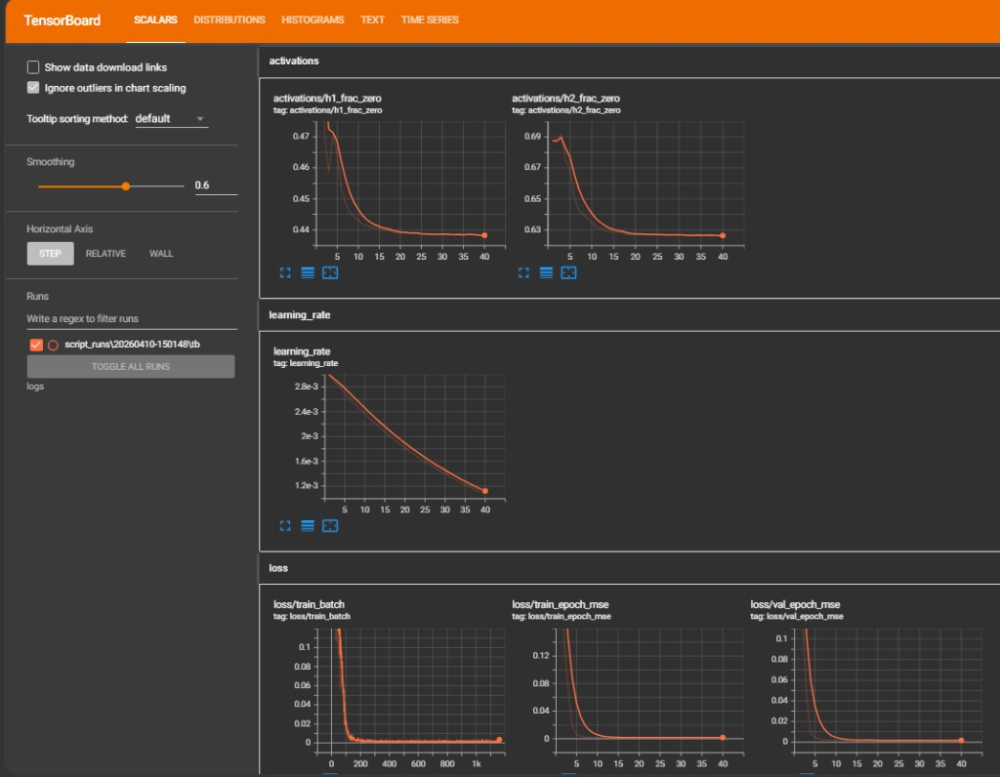
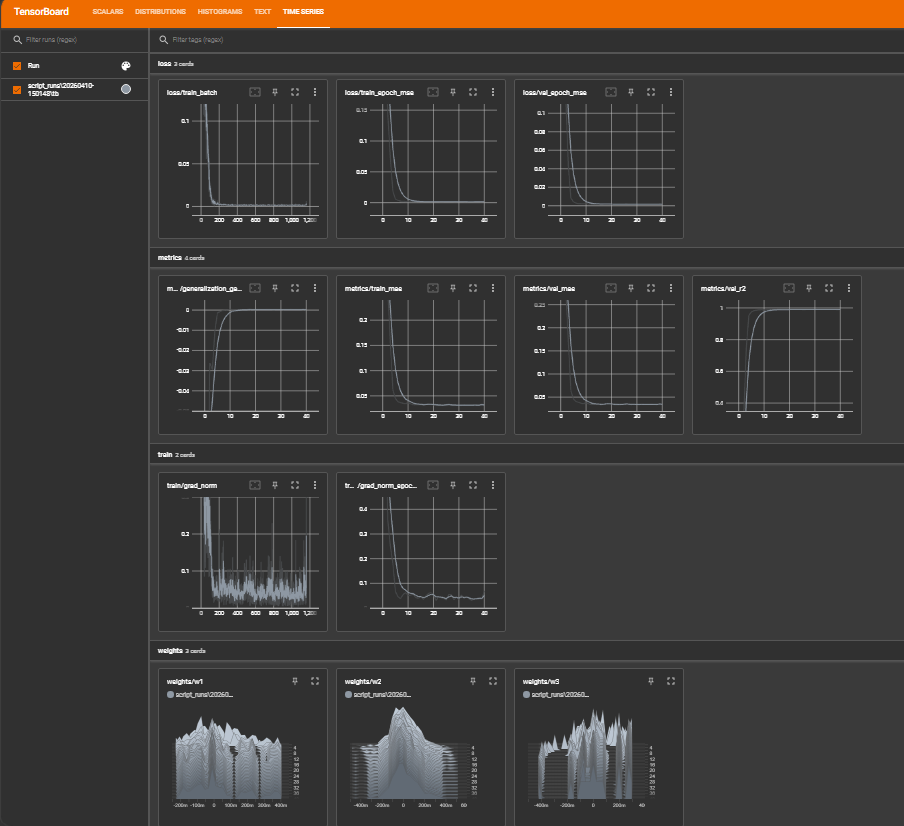
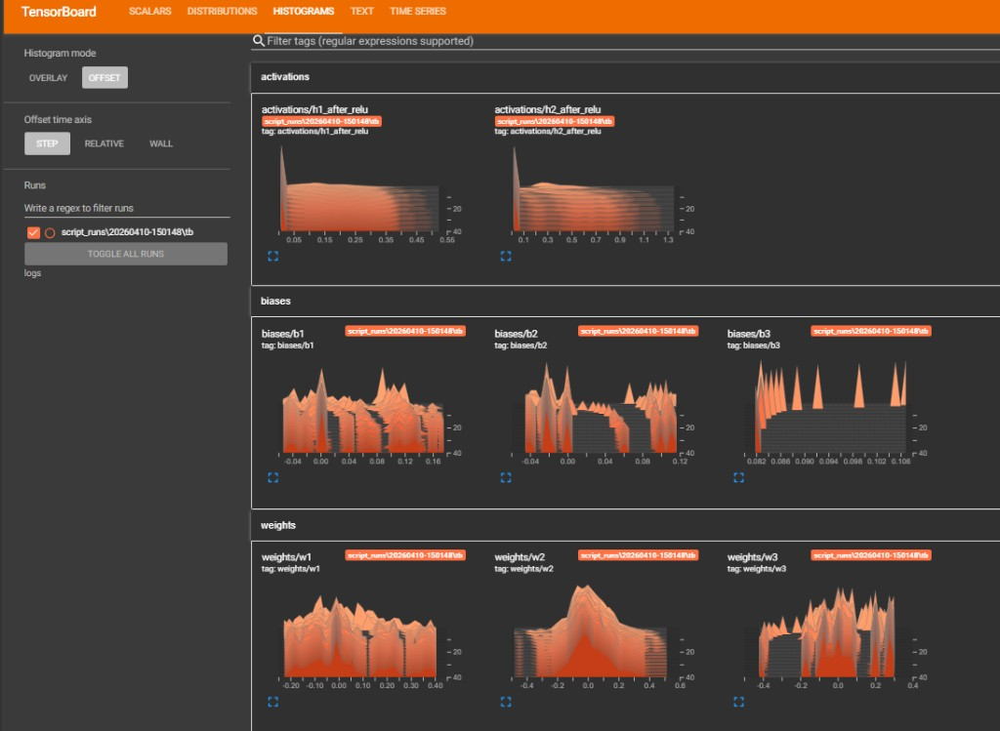
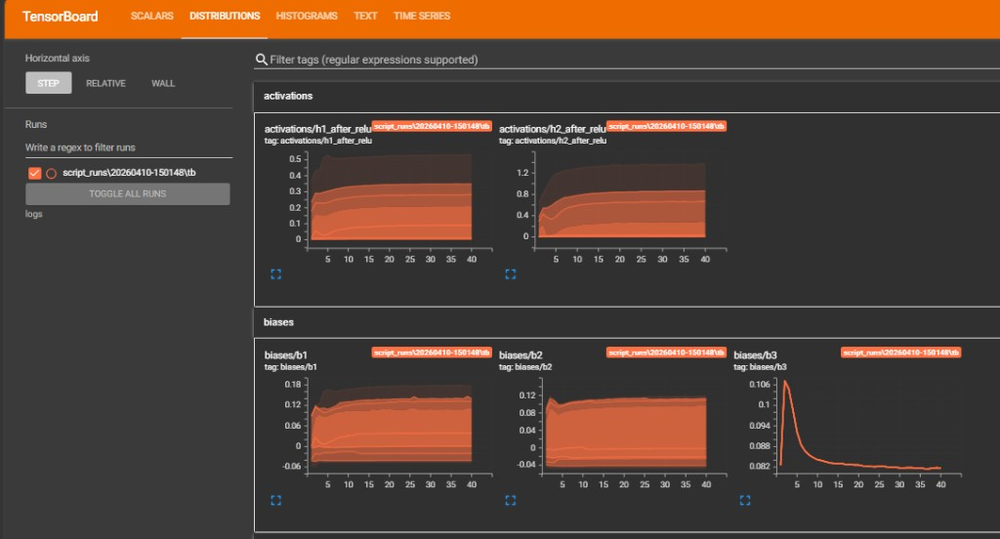

# TensorBoard Lab 


## What this lab does

### Goal

Train a small neural network on a **regression** task and send **scalars, histograms, and text** to **TensorBoard** so you can inspect learning curves, parameter distributions, and training health.

### What gets logged to TensorBoard

- **Scalars:** batch MSE, epoch train/val MSE, learning rate, **MAE**, **validation R²**, **generalization gap** (val − train MSE), **gradient norms** (per batch and epoch mean).
- **Histograms:** weights (`w1`–`w3`), biases (`b1`–`b3`), **ReLU activations** for hidden layers, plus **fraction of zero activations** per layer (ReLU “dead neuron” signal).
- **Text:** `run_config` with hyperparameters and data description (open the **Text** dashboard in TensorBoard).

---

## Expected results (what you should see)

After a full run (e.g. 40 epochs), typical patterns for **this synthetic linear problem** are:

1. **Loss** (`loss/train_batch`, `loss/train_epoch_mse`, `loss/val_epoch_mse`): sharp drop in the first several epochs, then **flat near zero**. Train and val track each other.
2. **Metrics** (`metrics/val_mae`, `metrics/val_r2`): MAE moves toward **0**; **R²** moves toward **1** (strong fit is expected because the target is almost linear in the inputs).
3. **Generalization** (`metrics/generalization_gap_mse`): tends toward **0** if train and val error stay aligned (no obvious overfitting on this simple task).
4. **Learning rate** (`learning_rate`): smooth **decay** if you use the default schedule.
5. **Gradients** (`train/grad_norm`, `train/grad_norm_epoch_mean`): batch norms are **noisy**; the epoch mean usually **decreases** as the loss flattens.
6. **Activations** (`activations/h*_after_relu`, `activations/h*_frac_zero`): ReLU outputs stay **≥ 0**; a **large fraction of zeros** is normal. A slow change in `frac_zero` is more informative than the absolute level.
7. **Biases** (`biases/b3`): the last bias is a **single scalar** (shape `[1]`), so in TensorBoard it often looks like a **thin line or spike**, not a wide histogram like `b1` / `b2`. That is expected.

Because the problem is **easy**, curves may look “boring” after ~10 epochs. That usually means the model has **already fit** the synthetic signal, not that TensorBoard is wrong.

---

## TensorBoard screenshots (my run)

The figures below are from a local run of **`lab1_tensorboard.py`** after opening TensorBoard with `python -m tensorboard.main --logdir logs`. The active run in the sidebar is under **`logs/script_runs/<timestamp>/tb`**.

### 1. Scalars: ReLU sparsity, learning rate, and loss



**What this shows:** **`activations/h1_frac_zero`** and **`h2_frac_zero`** fall slightly over training, meaning a bit more hidden units become non-zero as weights adjust. **`learning_rate`** decays smoothly (exponential schedule). **`loss/train_batch`** (many steps) drops quickly then stays flat; **`loss/train_epoch_mse`** and **`loss/val_epoch_mse`** (40 epochs) track together and approach zero, which matches an easy linear regression target.

### 2. Time Series: loss, metrics, gradients, and weights



**What this shows:** **Loss** tags separate noisy **batch** MSE from **epoch** train/val MSE. **Metrics** include **MAE**, **validation R²** climbing toward 1, and **generalization gap** settling near zero (train and val error stay aligned). **Train** shows **per-batch** gradient norm noise versus the **epoch-mean** norm trending down. **Weights** panels are histograms-over-time for **`w1`–`w3`**, showing stable learned distributions rather than blow-ups.

### 3. Histograms (offset mode): activations, biases, weights



**What this shows:** **Activations** after ReLU stay **non-negative** with a mass at zero (expected). **Biases** evolve over steps; **`b3`** looks tighter because it is a **single scalar** per step. **Weights** spread and shift early, then stabilize—consistent with normal training on this small network.

### 4. Distributions: activations and biases over steps



**What this shows:** **Distribution** view summarizes how **spread** (percentile bands) of **hidden activations** and **biases** changes from step 0 to 40. Bands widen early then flatten, which is typical once the model has found a good fit on this synthetic data.

---

## How to interpret the dashboards

- **Time Series / Scalars:** compare **train vs val** loss and MAE; watch **R²** on validation; use **generalization gap** to see if validation error systematically exceeds training error.
- **Histograms / Distributions:** check that weights **do not explode** (values racing toward huge magnitudes) or **vanish** (everything stuck at 0). Multi-modal weight shapes can be normal for small networks.
- **Per-batch loss:** useful for **noise** and short-term dynamics; **epoch** curves are easier for comparing train vs val.
- **Gradient norms:** large spikes early can happen; sustained growth epoch after epoch can indicate instability (less common here).

---

## Steps to run

### 1. Go to this directory

```powershell
cd "C:\Users\aksha\Downloads\MLOps\Labs\Tensorflow_Labs\TensorBoard"
```

### 2. Install dependencies

```powershell
pip install "tensorflow>=2.8" tensorboard packaging numpy
```
```powershell
pip install "protobuf>=3.20.3,<4"
```

### 3. Run training

```powershell
python lab1_tensorboard.py --epochs 40 --batch-size 32 --fresh
```

- `--fresh` deletes the `logs` folder first so runs do not mix.
- Disable per-batch scalar spam (optional): `python lab1_tensorboard.py --no-log-batch-scalars`
- Optional debugger dumps: add `--enable-debugger`

### 4. Launch TensorBoard

If the `tensorboard` command is not found, use:

```powershell
python -m tensorboard.main --logdir logs
```

Open a browser at **http://localhost:6006** (URL is also printed in the terminal).

### 5. What to open in the UI

- **Time Series** or **Scalars:** loss, metrics, learning rate, grad norms.
- **Histograms** / **Distributions:** weights, biases, activations.
- **Text:** `run_config`.

---

## CLI reference

| Argument | Default | Meaning |
|----------|---------|---------|
| `--epochs` | 40 | Number of training epochs |
| `--batch-size` | 32 | Mini-batch size |
| `--log-root` | `logs` | Root folder for all logs |
| `--fresh` | off | Delete `--log-root` before training |
| `--enable-debugger` | off | Enable TF Debugger V2 dumps under log root |
| `--log-batch-scalars` | on | Log per-batch loss and grad norm (`--no-log-batch-scalars` to turn off) |


